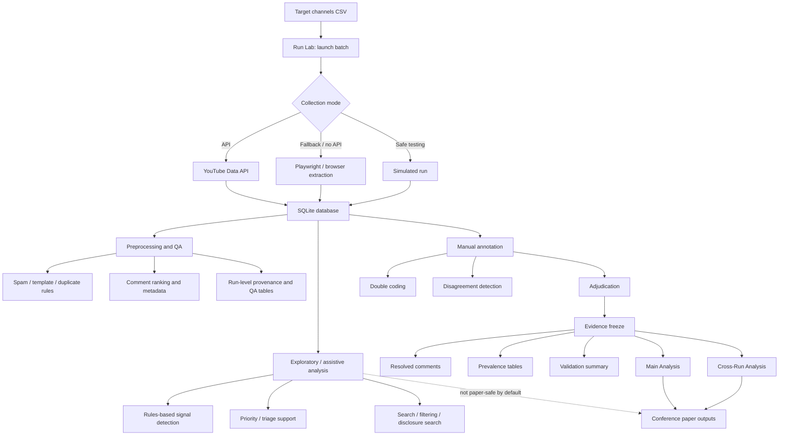

# Research Workflow For Reviewers

Date: 2026-04-07
Project: KES 2026 YouTube research console
Audience: co-authors, reviewers, replicators, and other researchers who need to understand how the app works end to end

## 1. Purpose

This app is a local human-in-the-loop research system for studying verification signals around generative-AI content on YouTube.

It is not just:
- a scraper
- an annotation tool
- a dashboard
- a classifier

It combines all four into one workflow with a strict boundary between:
- a validated evidence layer used for paper-facing claims
- an assistive / exploratory layer used for screening, prioritization, and follow-up

That boundary is the most important design principle in the project.

## 2. High-Level Workflow

## 3. What The System Actually Stores

The app uses a local SQLite database as the main research store.

Core entities:
- channels
- videos
- comments
- runs
- annotations

Important relationship:
- channel -> video -> comment

The app also stores:
- run metadata
- preprocessing flags
- annotation workflow fields
- adjudication status
- evidence-freeze summaries

The database is local-first. The main app logic is designed around SQLite, not a hosted cloud backend.

## 4. Data Collection Layer

Data collection starts from a CSV of target channels.

The app supports three run modes:
- `auto`
- `api_only`
- `playwright_only`

It also supports:
- `simulate`

Meaning of each:
- `auto`: try YouTube API first, then fall back when needed
- `api_only`: only use the YouTube API
- `playwright_only`: use browser-based extraction only
- `simulate`: generate a safe deterministic test run without live collection

Important credential note:
- The app does not require an AI API key for analysis
- The only external key in the main pipeline is a `YOUTUBE_API_KEY` for live YouTube data collection
- If no YouTube API key is provided, the system can still be used for:
  - simulated runs
  - local database review
  - annotation
  - exploratory analysis
  - validated modeling on already collected data

## 5. Preprocessing And Quality Control

Before comments become analysis-ready, the app applies deterministic preprocessing.

Main filters:
- spam
- template text
- duplicate comments

These are rules-based, not LLM-based.

Examples of what is checked:
- repeated links
- promotional patterns
- token repetition
- character flooding
- repeated comments across videos
- blacklist matches
- symbol saturation

The app keeps quality-control fields such as:
- `is_spam`
- `is_template`
- `is_duplicate`

These flags matter because most paper-facing analysis excludes flagged rows by default.

## 6. Where "AI" Appears In The Workflow

In the current app, "AI" mostly means local automation, not a cloud language model.

### 6.1 Rules-Based Signal Detection

The app automatically detects weak signals such as:
- skepticism
- proof-demand
- normalization
- AI mention / disclosure language
- low-information / noisy text
- simple language heuristics

This is done with:
- regex rules
- lexical feature extraction
- deterministic scoring

It does not call OpenAI, Anthropic, Gemini, or another LLM service.

### 6.2 Assistive Triage

The app computes:
- `triage_bucket`
- `triage_score`
- `priority_bucket`
- `priority_score`

These help users decide:
- what to read first
- what to code next
- what looks ambiguous
- what is probably low value

This is assistive only. It does not create validated labels by itself.

### 6.3 Statistical Modeling

The app also fits local statistical models for the conformity analysis.

These are not AI models in the LLM sense. They are classical statistical models implemented locally in Python.

Main example:
- mixed-effects logistic regression for conformity cascades

So there are really two different meanings of "AI" here:
- study topic: generative-AI content on YouTube
- local automation: rules and scoring used to support analysis

There is not currently a third layer of external LLM inference in the main app.

## 7. Manual Annotation Layer

The validated evidence layer is human-coded.

Core substantive labels:
- skepticism
- proof-demand
- normalization

Workflow:
1. comments are presented to coders
2. coders save labels independently
3. disagreements are detected automatically
4. adjudication resolves disagreements
5. resolved comments become eligible for the frozen evidence layer

The automation layer is visible during coding, but it is not meant to decide labels for the coder.

This matters methodologically:
- human judgment creates the confirmatory dataset
- automation helps with prioritization and screening
- automation does not replace validation

## 8. Evidence Freeze

The evidence freeze is the boundary between "working data" and "paper-safe data."

An evidence freeze records:
- selected run IDs
- resolved comment counts
- prevalence tables
- summary metrics
- exportable validation artifacts

Only resolved comments belong in the validated layer.

This means:
- exploratory work after the freeze should not silently change main results
- uncoded or weak-labeled comments do not enter the paper automatically
- paper claims should point back to the frozen evidence bundle

This is one of the strongest parts of the workflow for research transparency.

## 9. Analysis Layers

The app has three analytically different layers.

### 9.1 Validated Layer

Used for:
- paper claims
- confirmatory descriptive counts
- main conformity analysis
- pooled cross-run analysis

Input:
- resolved human-coded comments only

### 9.2 Assistive Layer

Used for:
- coding prioritization
- uncertainty review
- candidate surfacing
- screening

Input:
- local rules and scores
- not yet validated humanly

### 9.3 Exploratory Layer

Used for:
- disclosure search
- raw comment filtering
- signal exploration
- theme hunting

This layer is useful, but it is not paper-safe by default.

## 10. Main Empirical Model

The main conformity model works like this:

1. within each video, comments are ranked by:
   - like count descending
   - earlier timestamp as tie-break
2. the rank-1 comment is treated as the visible cue
3. comments ranked 2-20 are treated as downstream responses
4. the outcome is whether a response comment is skeptical
5. the main predictor is whether the top-ranked cue is skeptical

Moderators include:
- `channel_niche`
- standardized top-comment like count
- standardized hours since top comment

The model is a mixed-effects logistic regression with random effects for:
- channel
- video

In practical terms, the model asks:
- when the top visible comment is skeptical, are later comments more likely to be skeptical too?

## 11. Reliability And Adjudication

The app supports double coding and adjudication, but the current workflow has an important limitation:

- full pre-adjudication label history is not preserved for every adjudicated row

This means:
- final consensus is preserved
- full-dataset inter-rater reliability is not always recoverable afterward

So researchers should distinguish clearly between:
- final consensus in the validated dataset
- the subset on which raw coder agreement can still be computed directly

This is a workflow limitation, not a problem with the frozen consensus dataset itself.

## 12. What A Reviewer Should Understand About Reproducibility

The app is relatively strong on procedural reproducibility.

It preserves:
- run metadata
- execution mode
- run-level QA
- filtering rules
- annotation workflow state
- evidence-freeze exports
- analysis tables

It is weaker on:
- full historical reconstruction of all pre-adjudication coder states

So the reproducibility story is best framed as:
- strong workflow traceability
- strong frozen-output traceability
- partial limitation in retrospective IRR reconstruction

## 13. What Is Needed To Run Which Parts

### Needed for live collection
- `YOUTUBE_API_KEY` or `YOUTUBE_API_KEYS`
- browser dependencies for Playwright if browser extraction is used

### Not needed for local analysis
- no OpenAI key
- no Anthropic key
- no Gemini key

### Can run without external keys
- simulated collection
- browsing prior runs
- filtering and search
- auto-analysis
 - assistive triage support
- manual annotation
- evidence freeze review
- conformity analysis on existing local data

## 14. Main Strengths Of The Workflow

- one environment from collection to paper outputs
- explicit separation between validated and exploratory layers
- local, explainable automation
- double-coding and adjudication workflow
- frozen evidence base for paper claims
- reproducible exports for tables and downstream analysis

## 15. Main Limitations

- current adjudication flow does not preserve all pre-adjudication label histories
- exploratory views can be mistaken for validated outputs if not labeled carefully
- some app sections remain broad because the tool grew iteratively
- results depend on the quality of the frozen evidence scope and deduplication choices

## 16. Best Short Description For Other Researchers

Use this if someone asks what the app is:

> The app is a local human-in-the-loop research console for collecting YouTube comments, screening them with explainable rules, double-coding and adjudicating them, freezing a validated evidence layer, and running paper-facing conformity analyses on that validated subset while keeping exploratory automation separate.

## 17. Best Short Description Of How AI Is Included

Use this if someone asks whether the app uses AI:

> The app studies audience reactions to generative-AI content, but its own automation is mostly local and rules-based rather than LLM-based. It uses deterministic text heuristics, triage scoring, and local statistical models, not an external AI API, for most of the current workflow.

## 18. Reviewer Checklist

If another researcher wants to evaluate the workflow, they should ask:

1. What data were collected in which runs?
2. Which rows were excluded by preprocessing?
3. Which comments were human-coded?
4. Which comments were resolved versus exploratory only?
5. Which evidence freeze supports the reported claims?
6. Which outputs are paper-safe versus assistive?
7. Were duplicate videos or run-scope issues checked before modeling?
8. Is reliability being reported on the subset where raw coder records are preserved?

## 19. Bottom Line

This workflow is best understood as an evidence-governance system as much as an analysis system.

Its core contribution is not that it "uses AI" to classify comments automatically.
Its core contribution is that it helps researchers move from messy platform data to a defensible validated evidence layer, while keeping automation useful but methodologically bounded.
